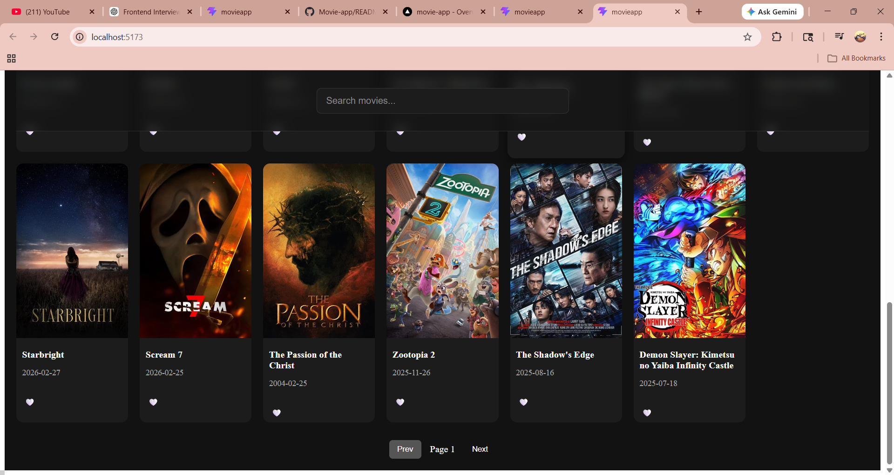

#  Movie Explorer App

A modern movie browsing web application built with React that allows users to discover, search, and manage their favorite movies with a smooth and responsive user experience.

---

##  Live Demo

 https://movie-app-phi-coral.vercel.app

---

##  Features

*  **Debounced Search** – Optimized API calls to reduce unnecessary requests
*  **Pagination** – Efficient handling of large datasets
*  **Favorites System** – Add/remove movies using Context API
*  **Persistent Storage** – Favorites saved using localStorage
*  **Skeleton Loading UI** – Improved perceived performance
*  **Responsive UI** – Clean and modern dark-themed interface

---

##  Tech Stack

* **React** (Hooks + Context API)
* **JavaScript (ES6+)**
* **CSS (Custom Styling)**
* **TMDB API**

---

##  Key Concepts Implemented

* Debouncing using `useRef`
* State management with Context API, persisted State using Local Storage
* Side effects handling using `useEffect`
* Conditional rendering for dynamic UI
* API handling with async/await

---

## Project Structure

```
src/
  components/
    MovieCard.jsx
    SkeletonCard.jsx
  pages/
    Home.jsx
    Favourites.jsx
  context/
    movieContext.js
  utils/
    getMovies.js
    searchMovie.js
```

---

## Installation & Setup

```bash
git clone https://github.com/Aryannn959/Movie-app.git
cd movie-app
npm install
npm run dev
```

---

##  Screenshots

##  Screenshots
 Home Page



 Favorites
[Favorites](./images/ScreenShot2.png)

---

## Future Improvements

* Infinite scrolling for better UX
* Improved error handling UI
* API response caching
* Dark/Light theme toggle

---

##  Author

Aryan Pratap Singh


